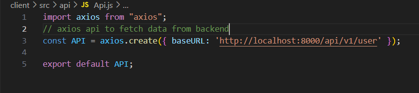

# Getting Started with Create React App
1. Run npm install command in terminal
2. Open the ./src./api directory
3. In the Api.js check baseURL and enter the baseURL to be the URL of node server like 

4. run npm start to start the app.