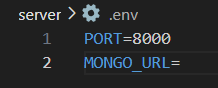

# Getting started with node app
Setup to run server
1. Run 'npm install' command in terminal
2. Create .env file in server directory
    The content of .env file will look like 
    
    * Enter your mongo_url here. 
3. run node index.js